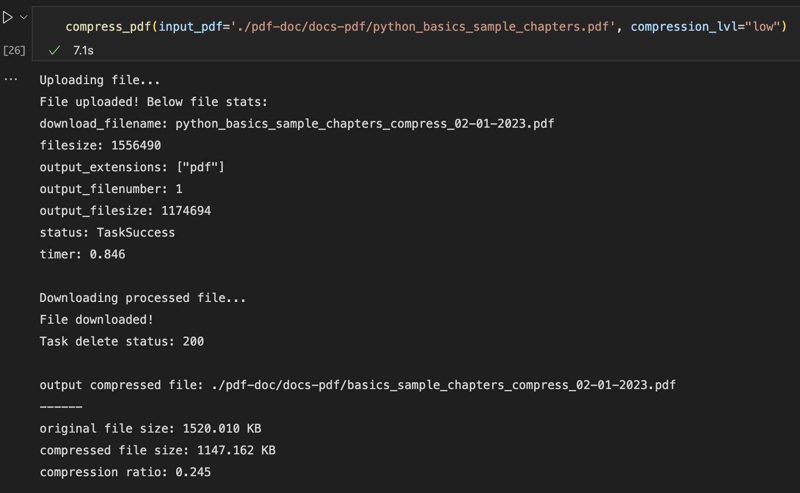
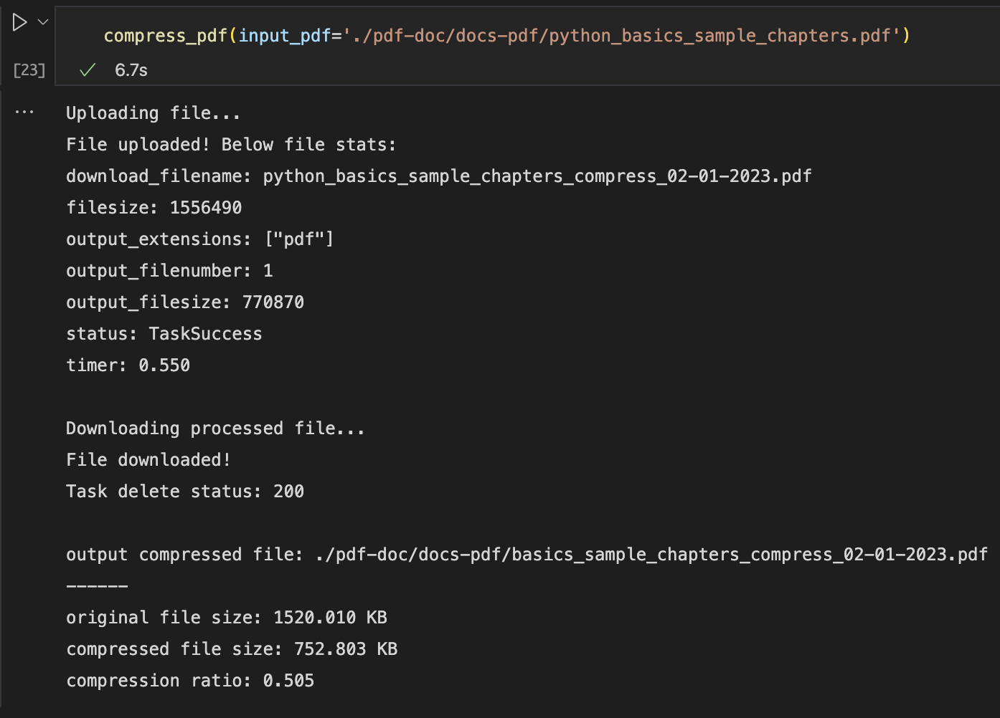
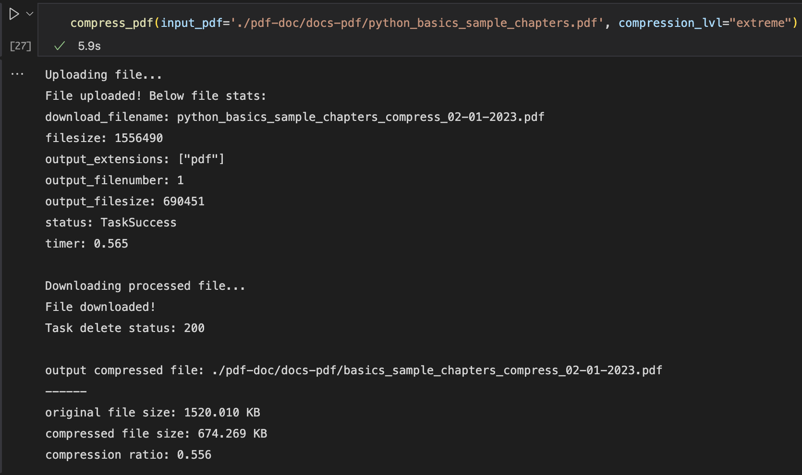
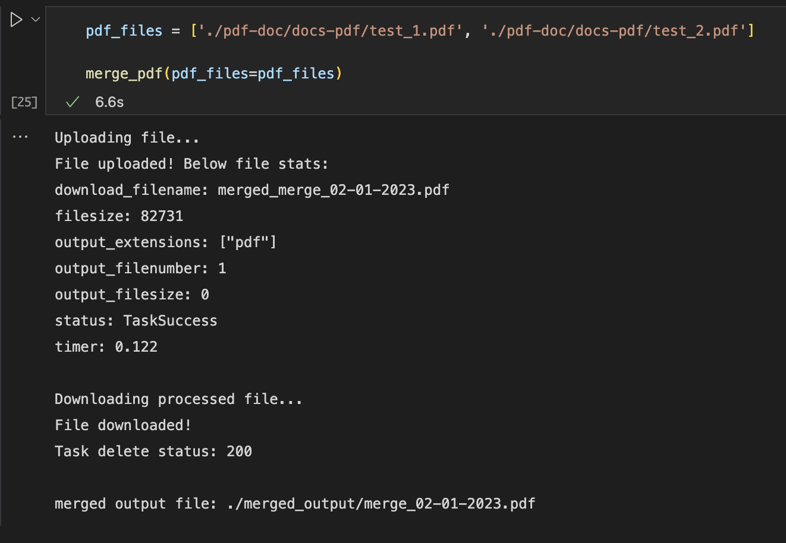

## Python pdf compress and merge

This repository contains python notebook to compress and merge PDF files using *pylovepdf* library. This *pylovepdf* library allows to manipulate pdf using the API of http://www.ilovepdf.com. 
PDF (portable document format) is a platform independent file format which can be used to store data like documents and images. It is a widely used format for data sharing. In this repo there is a notebook `pdf_handling.ipynb` which has functions to compress and merge pdf files. It can be used to compress and merge your personal PDF documents.

There are some pre-requisites to use pypdflove. Please ensure those are followed before using the notebook in this repo.

### Prerequisites:
* [developer account] (https://developer.ilovepdf.com) to get a public key to use the API.
* [Python 3.x.x]
* [Requests] (http://it.python-requests.org/it/latest/)
* create venv before installing package using requirement.txt `python3 -m venv pypdf`. venv name can be per your liking. Its always good practice to provide a meaningful name.

### Limitations:

The ilovepdf API has a free version with limitations. The free account can process only 250 files per month for any API action.

### pdf compression:

Many portals have size limitations when uploading PDF files. This notebook can help you achieve the size reduction using the `compress_pdf` function. the *compression_lvl* argument can accept one of the below values:

* low
* recommended
* extreme

There is no much distortion to the compressed output when compressed. The max compression achieved with sample input pdf was 56%

compression ratio for each compression_lvl:
* low => 25%
* recommended => 51%
* extreme => 56%

### compress function invocation:
`compress_pdf(input_pdf="<absolute path to pdf file>", compression_lvl="<value>")`

### compressing input pdf using various compression_lvl:

*compression_lvl="low"*

`compress_pdf(input_pdf='./pdf-doc/docs-pdf/python_basics_sample_chapters.pdf', compression_lvl="low")`

*compression_lvl="recommended"*

`compress_pdf(input_pdf='./pdf-doc/docs-pdf/python_basics_sample_chapters.pdf', compression_lvl="recommended")`

*compression_lvl="extreme"*

`compress_pdf(input_pdf='./pdf-doc/docs-pdf/python_basics_sample_chapters.pdf', compression_lvl="extreme")`

### pdf merge:
We would have come across real world scenarios where there would be a need to combine multiple pdfs into one and upload. ex: document verification for immigration, marksheets for educational document verification etc.

The notebook has another function to perform pdf merge. 

### merge function invocation:
`merge_pdf(pdf_files='<list of input pdfs>')`

* The list size is limited by the `(2^31-1)/4 for 32-bit systems but (2^63-1)/8 for 64-bit systems` roughly half billion elements on 32bit system or billion billions on 64bit system.

### merge two sample pdfs using merge_pdf func:

